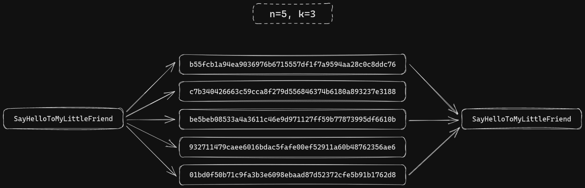

<div align="center">
  

  <h1>shamir</h1>

  <p>Split and combine secrets using <a href="https://en.wikipedia.org/wiki/Shamir%27s_Secret_Sharing">Shamir's Secret Sharing</a> algorithm</p>

  <a href="https://github.com/incipher/shamir/releases/latest">
    
  </a>
</div>

## Description

Featuring UNIX-style composability, this command-line tool facilitates splitting and combining secrets using [HashiCorp Vault's implementation](https://github.com/hashicorp/vault/blob/main/shamir/shamir.go) of [Shamir's Secret Sharing](https://en.wikipedia.org/wiki/Shamir%27s_Secret_Sharing) algorithm.

## Background

Formulated by [Adi Shamir](https://en.wikipedia.org/wiki/Adi_Shamir) (the S in [RSA](<https://en.wikipedia.org/wiki/RSA_(cryptosystem)>)) in his 1979 paper [“How to share a secret”](http://web.mit.edu/6.857/OldStuff/Fall03/ref/Shamir-HowToShareASecret.pdf), Shamir's Secret Sharing is an algorithm that allows you to split a secret (e.g. a [symmetric encryption](https://en.wikipedia.org/wiki/Symmetric-key_algorithm) key) into $n$ shares, which can be combined later to reconstruct that secret.



Not all shares need to be present for a successful reconstruction, but actually any subset thereof with a size greater than or equal to the minimum threshold $k$, where $2 \le k \le n$. The algorithm mathematically guarantees that knowledge of $k - 1$ shares reveals absolutely no information about the original secret.

## Usage

### Interactive

```
$ shamir split -n 5 -k 3
Secret: ************************
b55fcb1a94ea9036976b6715557df1f7a9594aa28c0c8ddc76
c7b340426663c59cca8f279d556846374b6180a893237e3188
be5beb08533a4a3611c46e9d971127ff59b77873995df6610b
932711479caee6016bdac5fafe00ef52911a60b48762356ae6
01bd0f50b71c9fa3b3e6098ebaad87d52372cfe5b91b1762d8
```

```
$ shamir combine -k 3
Share #1: b55fcb1a94ea9036976b6715557df1f7a9594aa28c0c8ddc76
Share #2: be5beb08533a4a3611c46e9d971127ff59b77873995df6610b
Share #3: 01bd0f50b71c9fa3b3e6098ebaad87d52372cfe5b91b1762d8
SayHelloToMyLittleFriend
```

### Non-interactive

```
$ echo "SayHelloToMyLittleFriend" | shamir split -n 5 -k 3 > shares.txt
Secret: ************************
```

```
$ head -n 3 shares.txt | shamir combine -k 3
SayHelloToMyLittleFriend
```

## Installation

| Platform     | Package manager             | Command                              |
| ------------ | --------------------------- | ------------------------------------ |
| Linux, macOS | [Homebrew](https://brew.sh) | `$ brew install incipher/tap/shamir` |

## License

<a href="https://creativecommons.org/publicdomain/zero/1.0/">CC0</a>
