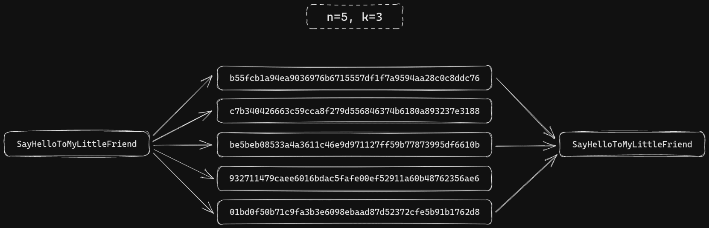

# Background

Formulated by [Adi Shamir](https://en.wikipedia.org/wiki/Adi_Shamir) (the S in [RSA](<https://en.wikipedia.org/wiki/RSA_(cryptosystem)>)) in his 1979 paper [“How to share a secret”](http://web.mit.edu/6.857/OldStuff/Fall03/ref/Shamir-HowToShareASecret.pdf), Shamir's Secret Sharing is an algorithm that allows you to split a secret (e.g. a [symmetric encryption](https://en.wikipedia.org/wiki/Symmetric-key_algorithm) key) into $n$ shares, which can be combined later to reconstruct that secret.

Not all shares need to be present for a successful reconstruction, but actually any subset thereof with a size greater than or equal to the minimum threshold $k$, where $2 \le k \le n$. The algorithm mathematically guarantees that knowledge of $k - 1$ shares reveals absolutely no information about the original secret.
